# Clones

Browser games, mostly remakes of classics, one per subdirectory. Each one is published as a playable artifact on claude.ai. Every game was built by Claude Code, and the Prompt column quotes the request that started it, word for word, plus any follow-ups that changed the design.

| Game | Description | Prompt | Play | Screenshots |
| --- | --- | --- | --- | --- |
| **Balloon Fight**<br>`balloon-fight/` | A remake of the 1984 NES arcade game. Flap over rivals to pop their balloons, stay out of the water, and reach the glowing perch to zap the sky. Procedural graphics and jsfxr sound effects. | <i>"create a reimplementation of the nes classic balloon fight playable on the web"</i> | [claude.ai](https://claude.ai/artifact/HTYvj1cEbTeAMAfVvph4Xu) |    |
| **Hollowmere**<br>`hollowmere/` | A gothic action RPG in the style of *Diablo*. Go down through the crypts beneath a drowned parish with click-to-walk combat, Soulfire and Requiem spells, blood and wax potions, and a character ledger. | <i>"reimplement diablo 2 as a webgl game, make it spooky"</i> | [claude.ai](https://claude.ai/artifact/8TDep6fsj2rwpRtd8Gqs7F) |    |
| **Howard the Duck '86**<br>`howard-the-duck/` | A 3D open-world game based on the 1986 film. Howard is stranded in Cleveland and has to find six laser-spectroscope parts, from the lakefront pier to a rooftop reached by fire escape. Along the way he Quack Fus punks, scatters Dark Overlord shades and dodges a possessed Dr. Jenning, then opens a portal back to Duckworld from the Dynatechnics lab. | <i>"create a subdirectory for a new game, a webgl based 3d open world howard the duck game where you need to collect parts to build a device to open a portal home and avoid enemies, base it on the 80s howard the duck not the mcu howard the duck, update the readme, publish a claude.ai artifact and push to github"</i> | [claude.ai](https://claude.ai/artifact/KYaW2vCf9dTPT9Ag7SfCuy) |    |
| **Kahuna Curl**<br>`kahuna-curl/` | A tropical 3D surfing game in the spirit of *California Games* and *T&C Surf Designs*. Ride a peeling wave that curls into a barrel, stall to get tubed, spin airs off the lip, and dodge driftwood, reef rocks, turtles, jellyfish and paddlers during a two-minute heat. | <i>"create a new subdirectory and webgl game, it should be a surfing game similar to california games or t&c surf designs nes game , the game should be 3d where you are trying to surf a curled wave and avoid obstacles, the game should be very tropical"</i> | [claude.ai](https://claude.ai/artifact/UQzrGGoU6zvZ8AodJoWzAh) |    |
| **Kraken Squall**<br>`kraken-squall/` | A 3D boss fight on a stormy night sea. Row a small whaleboat through heaving waves while a giant squid attacks. Harpoon its arms, row clear of the red wake before an arm slams down, hack free with an axe when an arm coils around the boat, and strike its eye when it surfaces. | <i>"create a new subdirectory and webgl game, where you are in a small boat in a rough sea fighting a giant squid"</i> | [claude.ai](https://claude.ai/artifact/JKg5BpV4JWJLsCutTXJL7j) | 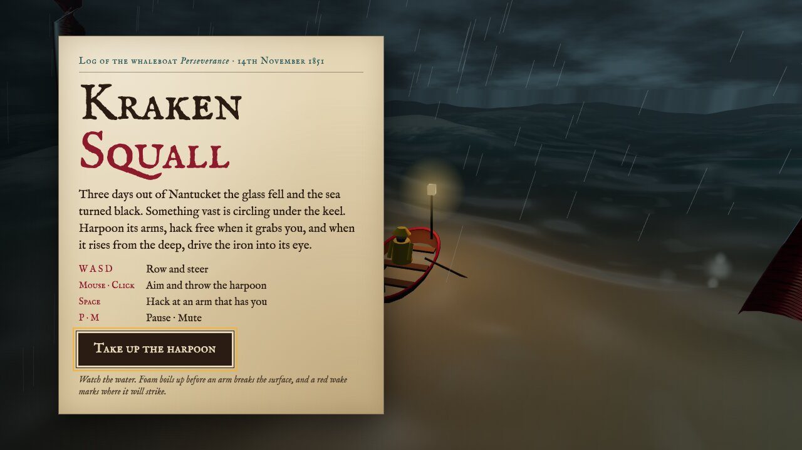 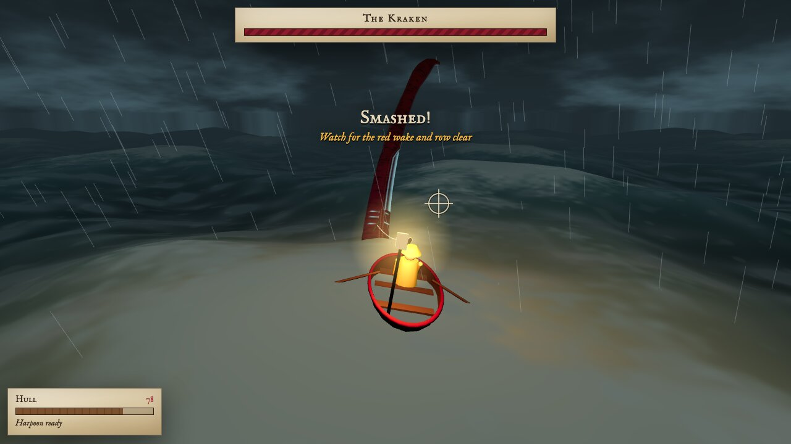 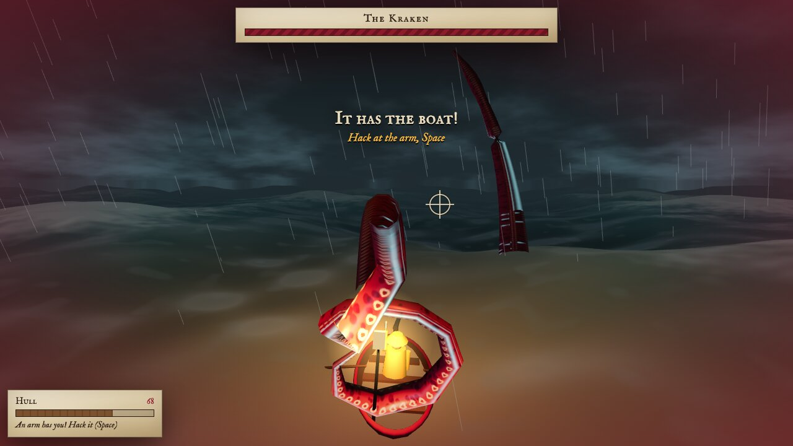 |
| **Polygon Wing**<br>`polygon-wing/` | A rail shooter in the style of *Star Fox*. Lead the Lancer squadron down a canyon, barrel-roll to deflect shots, use boost, brake and nova bombs, and take down the Warden carrier. | <i>"create a 3d reimplementation of the snes game starfox"</i> | [claude.ai](https://claude.ai/artifact/Ln6RLYrcfee1RzavWucQV2) |    |
| **Radio Rally 3D**<br>`radio-rally-3d/` | A three.js remake of *R.C. Pro-Am*. Race RC trucks across 6 themed tracks, fire missiles and drop bombs, collect upgrades, and finish in the top 3 to advance. | <i>"reimplement the nes class rc pro-am as a webgl game, give the game a more 3d feel"</i> | [claude.ai](https://claude.ai/artifact/BrYaqAMRhTCiadaWU75ytZ) |    |
| **Rotgate**<br>`rotgate/` | A coin-op dungeon crawl in the mould of *Gauntlet*, with zombies. Pick one of four survivors, then fight down ten floors of plague catacombs while your wound bleeds health away every second. Smash the graves that spit out the dead, hunt medkits to buy back time, burn a room with a flare, open bricked-up vaults with keys, shoot through cracked brick for shortcuts, outrun a Hollow that bullets pass straight through, and finish the Gravemother at the bottom. | <i>"create a new subdirectory and implement a webgl game that is similar to guantlet but zombies"</i> | [claude.ai](https://claude.ai/artifact/3QuiyzQm6b8M1khjcg4rPK) | 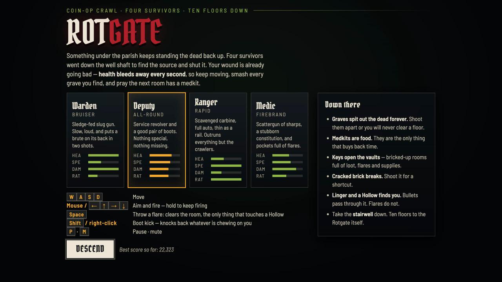 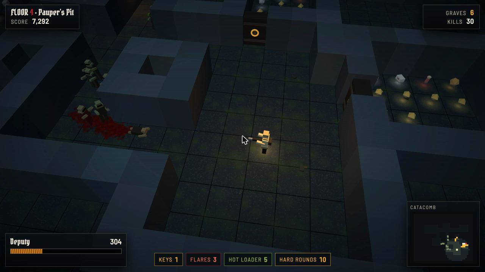 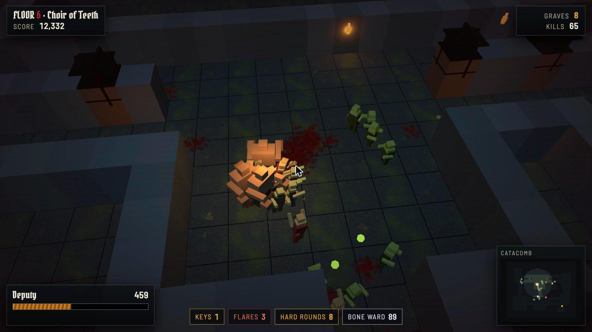 |
| **Shred City '87**<br>`shred-city/` | A radical 80s 3D skateboarding game in the spirit of *T&C Surf Designs* and *Skate or Die*. Bomb down a day-glo SoCal main street, ollie cones and trash cans, kickflip, shove-it, grab and spin, grind rails, ledges and curbs with a balance meter, launch kickers over parked cars, and collect letters to spell RADICAL. | <i>"create a new subdirectory and webgl game for a skateboarding game like the nes games t&c surf design and skate or die.  give it an 80s radical asthetic"</i> | [claude.ai](https://claude.ai/artifact/QMQuM3CudPBwYf9Dz2NRCu) | 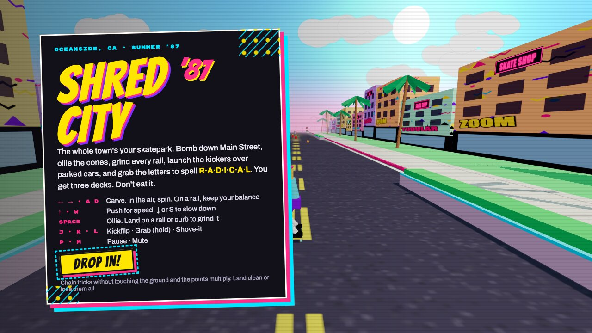 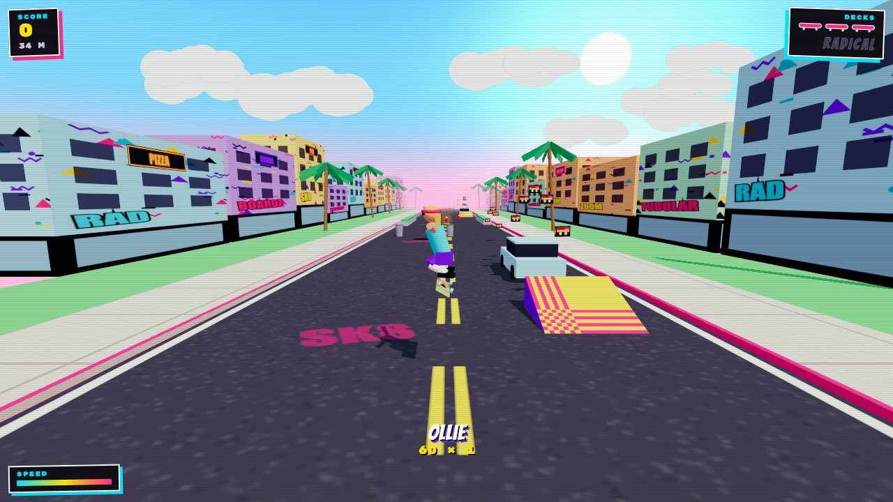 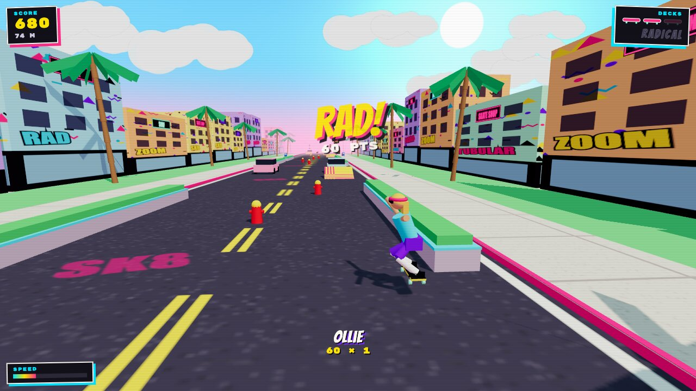 |
| **Spike Beach '89**<br>`spike-beach/` | A 3D take on *Super Spike V'Ball*: 2-on-2 beach volleyball seen from a fixed sideline camera, with the sun setting over the ocean behind the court. Dig, set, jump and spike with an aimed hit, block at the net, and serve floaters or jump serves against Rookie or Pro CPU opponents. | <i>"add a new subdirectory and webgl game for a 3d version of nes game super spike v-ball , it shoul use a fixed perspective from a high angle"</i><br><br>Follow-ups: <i>"the controls are sluggish can we make them more responsive and smooth"</i> · <i>"can you make the camera angle lower to catch the sunset in the background"</i> | [claude.ai](https://claude.ai/artifact/EBCHGaE9Hgx6fhF2vV5Baw) | 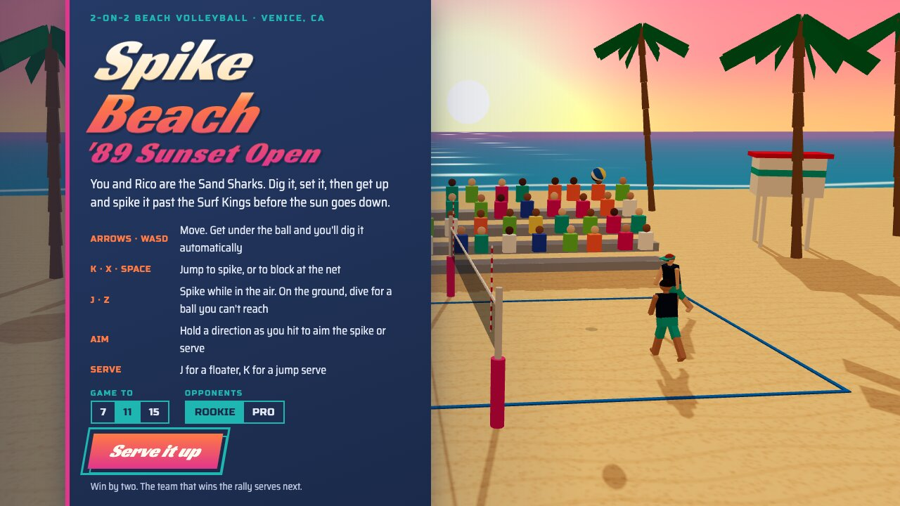 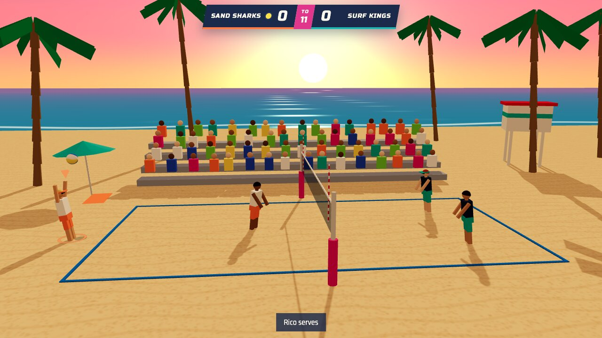 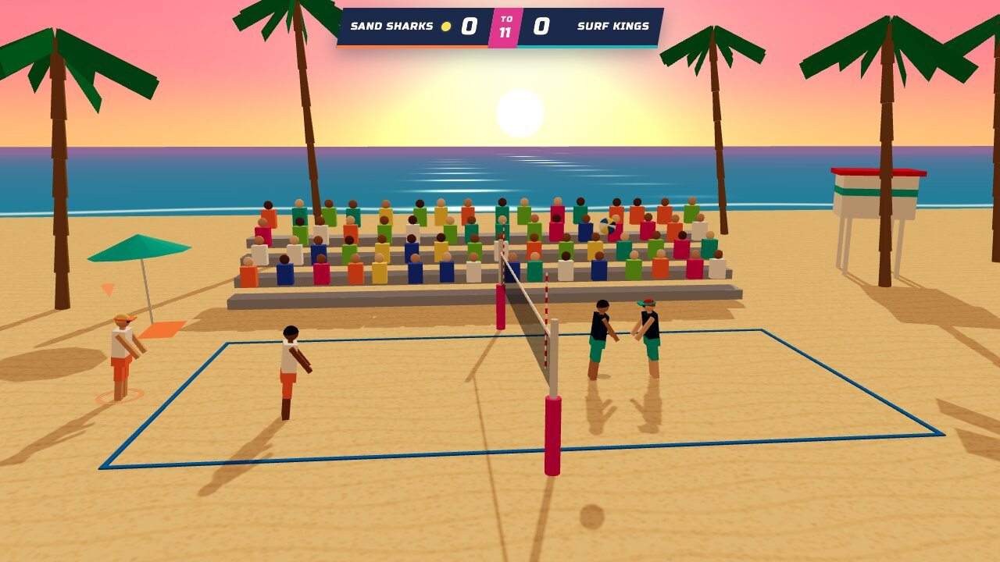 |
| **Tidebreaker**<br>`tide-breaker/` | An arcade jet-ski racer in the style of *Wave Race 64*, with simulated waves, buoy slaloms, AI rivals and a 3-lap championship. | <i>"reimplement the nintendo 64 game wave race 64 as a webgl game to be played in the browser."</i><br><br>Follow-ups: <i>"add motion blur to the game when you are moving fast"</i> | [claude.ai](https://claude.ai/artifact/MxmA414vzk6wMkjQfhVSs9) |    |
| **X-COM: Crash Site Recovery**<br>`xcom/` | The tactical battlescape from *UFO: Enemy Unknown* (1994). Fight turn-based UFO crash-site missions on destructible voxel maps, with time units, reaction fire, fog of war, a persistent squad and alien AI. | <i>"reimplement classic xcom as a webgl game, do not implement the base simulation, budget, economy portions. focus only on the ufo crash site retrieval portion"</i> | [claude.ai](https://claude.ai/artifact/5szGFVCsB7wENEoHuBRweQ) |    |
| **Zelda Isometric**<br>`zelda/` | *The Legend of Zelda* rebuilt as an isometric 3D voxel world. Explore the overworld, caves and the first dungeon, and switch to a classic top-down camera at any time. | <i>"reimplement the nes classic legend of zelda as a 3d isometric webgl game"</i> | [claude.ai](https://claude.ai/artifact/TwG1RXJhuovV8pANoYuLep) |    |
| **Zenithian Chronicles**<br>`zenithian-chronicles/` | A retro JRPG inspired by *Dragon Quest*. Explore towns, caves and an overworld, fight turn-based battles, gather five heroes, master the elements, and defeat the Dragon Lord. Progress saves automatically. | <i>"recreate the nes classic game dragon warrior 4 but make it better, it should be playable on the web and deployed as an artifact"</i><br><br>Follow-ups: <i>"search the web for a tile set to use for the game"</i> | [claude.ai](https://claude.ai/artifact/YNVvekSzYdBRB77HFaL3nj) |    |

## Running locally

Most games use ES modules, so serve them over HTTP instead of opening the files directly:

```sh
cd <game> && python3 -m http.server 8080
```

`xcom/` and `zelda/` use Vite. Run `npm install && npm run dev` in those folders.
